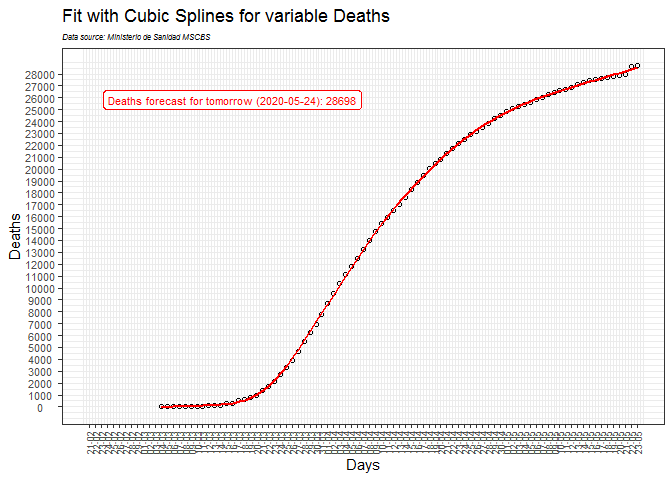

Covid-19: The case of Spain
================
JMSS \[Usal - CIC\]
(updated: 21 may 2020)

# Models for the COVID-19 pandemic in Spain

## DATA

Daily data: [Datadista
GitHub](https://github.com/datadista/datasets/tree/master/COVID%2019)
(and Ministerio de Sanidad
[MSCBS](https://www.mscbs.gob.es/profesionales/saludPublica/ccayes/alertasActual/nCov-China/situacionActual.htm))

<!-- --><!-- --><!-- --><!-- -->

Since we do not know the true data of infected people, two important
variables to take into account are the daily increase in infected and
death people.

<!-- --><!-- -->

The following graph shows the differences between CC.AA. (regions) in
mortality per 10,000 inhabitants.

<!-- -->

-----

## CUBIC SPLINES

Since April 5, I propose this new model to predict the number of deaths
and infecteds, cause the SIR and Regression models seem to make bigger
mistakes in their predictions. Since May 20 the model use as “infecteds”
the number of confirmed only by PCR.

It is based on interpolation with cubic splines. See
[Wikipedia](https://en.wikipedia.org/wiki/Spline_interpolation)

<!-- -->

<!-- -->

##### Infecteds forecast for tomorrow (2020-05-22): 233519

##### Deaths forecast for tomorrow (2020-05-22): 27992

Previous predictions:

    Infecteds forecast:

    20-05 -> predicted = 232037; observed = 232555; error = -0.22%
    21-05 -> predicted = 233073; observed = 233037; error =  0.02%

    Deaths forecast:

    06-04 -> predicted = 13092; observed = 12469; error =  4.76%
    07-04 -> predicted = 13692; observed = 13224; error =  3.42%
    08-04 -> predicted = 14541; observed = 13981; error =  3.85%
    09-04 -> predicted = 15312; observed = 14760; error =  3.61%
    10-04 -> predicted = 15921; observed = 15407; error =  3.23%
    11-04 -> predicted = 16448; observed = 15905; error =  3.30%
    12-04 -> predicted = 16863; observed = 16515; error =  2.06%
    13-04 -> predicted = 17591; observed = 17064; error =  3.00%
    14-04 -> predicted = 18006; observed = 17600; error =  2.25%
    15-04 -> predicted = 18623; observed = 18282; error =  1.83%
    16-04 -> predicted = 19102; observed = 18901; error =  1.05%
    17-04 -> predicted = 19681; observed = 19490; error =  0.97%
    18-04 -> predicted = 19826; observed = 20046; error = -1.11%
    19-04 -> predicted = 20608; observed = 20454; error =  0.75%
    20-04 -> predicted = 20863; observed = 20851; error =  0.06%
    21-04 -> predicted = 21251; observed = 21283; error = -0.15%
    22-04 -> predicted = 21712; observed = 21717; error = -0.02%
    23-04 -> predicted = 22152; observed = 22156; error = -0.02%
    24-04 -> predicted = 22597; observed = 22521; error =  0.34%
    25-04 -> predicted = 22891; observed = 22898; error = -0.03%
    26-04 -> predicted = 23280; observed = 23184; error =  0.41%
    27-04 -> predicted = 23478; observed = 23516; error = -0.16%
    28-04 -> predicted = 23852; observed = 23813; error =  0.16%
    29-04 -> predicted = 24123; observed = 24272; error = -0.62%
    30-04 -> predicted = 24728; observed = 24537; error =  0.77%
    01-05 -> predicted = 24811; observed = 24818; error = -0.03%
    02-05 -> predicted = 25105; observed = 25097; error =  0.03%
    03-05 -> predicted = 25376; observed = 25260; error =  0.46%
    04-05 -> predicted = 25428; observed = 25424; error =  0.02%
    05-05 -> predicted = 25592; observed = 25610; error = -0.07%
    06-05 -> predicted = 25798; observed = 25854; error = -0.22%
    07-05 -> predicted = 26101; observed = 26062; error =  0.15%
    08-05 -> predicted = 26283; observed = 26291; error = -0.03%
    09-05 -> predicted = 26528; observed = 26469; error =  0.22%
    10-05 -> predicted = 26657; observed = 26613; error =  0.17%
    11-05 -> predicted = 26764; observed = 26737; error =  0.10%
    12-05 -> predicted = 26867; observed = 26909; error = -0.16%
    13-05 -> predicted = 27096; observed = 27091; error =  0.02%
    14-05 -> predicted = 27288; observed = 27308; error = -0.07%
    15-05 -> predicted = 27538; observed = 27449; error =  0.32%
    16-05 -> predicted = 27597; observed = 27549; error =  0.17%
    17-05 -> predicted = 27667; observed = 27634; error =  0.12%
    18-05 -> predicted = 27737; observed = 27693; error =  0.16%
    19-05 -> predicted = 27768; observed = 27793; error = -0.09%
    20-05 -> predicted = 27847; observed = 27888; error = -0.15%
    21-05 -> predicted = 27998; observed = 27940; error =  0.21%

-----

\#StayAtHome \#QuedateEnCasa
